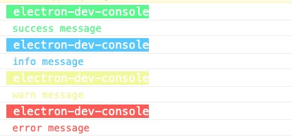

# electron-dev-console

一个用于在渲染进程查看主进程输出的 electron 开发调试工具



**why?**

在开发 electron 应用中，主进程可以通过 `--inspect` 来调试主进程，但是有时候打包过后的应用与开发时表现并不一致，这个时候要调试主进程却只能通过 `electron-log` 之类的日志库通过写日志的方式调试，这似乎有点笨拙，因此有了这个仓库。

## how to use

```bash
npm i -S electron-dev-console
```

in renderer process

```js
import { renderer } from 'electron-dev-console'

renderer.init()
```

in main process

```js
import { main } from 'electron-dev-console'
const win = new BrowserWindow({
  // your config
})

main.init(win)

main.success('success message')
main.info('info message')
main.warn('warn message')
main.error('error message')
```
